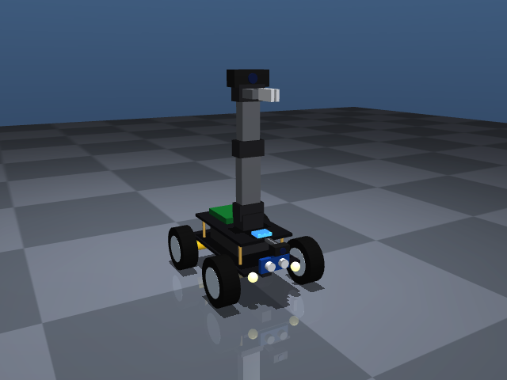
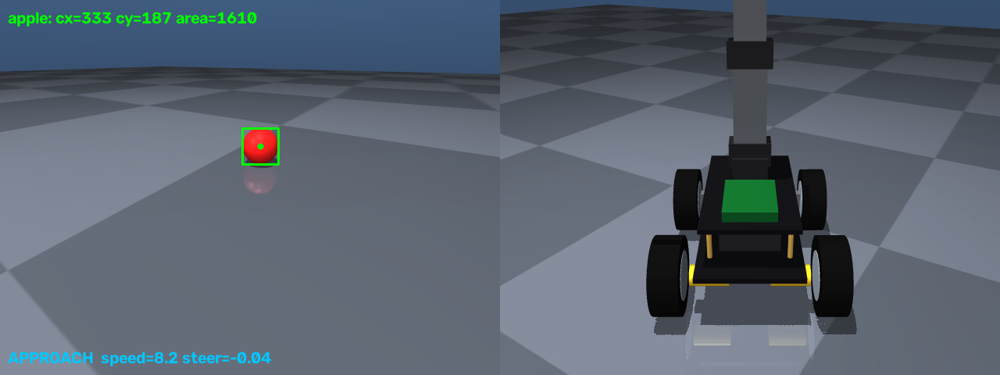
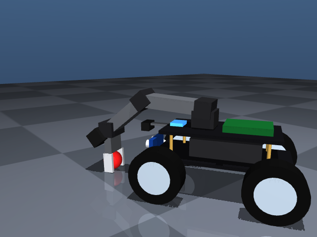
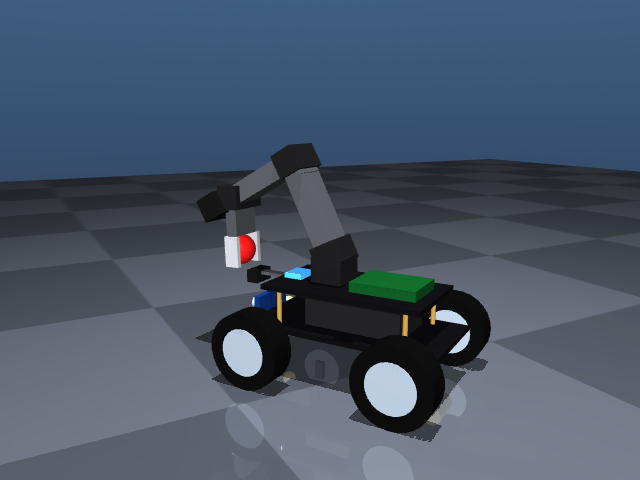

# PiCar Apple Picker — Vision-Guided Mobile Manipulation in MuJoCo

A simulated robot car, modeled after the **Adeept PiCar Pro V2** kit, that **finds a red apple with its camera, drives to it, and picks it up with its 4-DOF arm** — fully autonomously.

Everything runs in [MuJoCo](https://mujoco.org): the robot model is written from scratch in MJCF, perception uses OpenCV on rendered camera frames, and the controller is a hand-written state machine with a P-controller and analytic inverse kinematics.


*Left: the robot's front camera with the detection and current state. Right: third-person view. Three random apple placements, played at 2× speed — [full-length video (MP4)](media/demo.mp4).*

| Robot | Front camera + detection (left) / chase camera (right) |
|---|---|
|  |  |

| Grasping | Holding the apple |
|---|---|
|  |  |

## Results

Measured with `evaluate.py` — the apple is placed at a random spot 0.5–1.5 m away from the car, **in any direction** (including behind it):

| Metric | Value |
|---|---|
| Successful pick-ups | **50 / 50** |
| Average time to pick up | 20.6 s (simulated) |
| Camera-based apple position error | 0.6 mm mean, 1.4 mm max |

A pick-up counts as successful only if the apple is still held more than 10 cm above the ground two seconds after the grasp.

## What the robot can do

- **Drive like a real car** — servo-steered front wheels (both wheels coupled with an `<equality>` constraint) and motor-driven rear wheels.
- **See** — a wide-angle front camera for navigation and a camera on the arm, like the real kit.
- **Detect the apple** — HSV color segmentation + shape filtering, so a red box is *not* mistaken for the apple.
- **Search → approach → align → grasp → lift** — a state machine that decides what to do ~30 times per second.
- **Locate the apple in 3D from a single image** — a ray from the camera through the apple's pixel, intersected with the ground plane.
- **Move the arm with inverse kinematics** — closed-form IK (yaw + two-link law of cosines) keeping the gripper pointed down.
- **Keyboard teleoperation** — hold-to-move driving and arm control in the MuJoCo viewer.

## How it works

### 1. Robot model (`picar.xml`)
- Two-layer chassis, 18650 battery pack, Raspberry Pi board, sonar, headlights — dimensions follow the real kit.
- **Steering**: each front wheel sits inside a *knuckle* body that rotates about z; the wheel itself rotates about y.
- **Arm**: `arm_yaw → shoulder → elbow → wrist` + a parallel gripper (two slide joints coupled by an equality constraint).
- **Actuators**: `velocity` actuators for the rear wheels, `position` actuators (servos) for steering and the arm, with realistic torque limits (`forcerange`) — without them the arm could shove the whole car across the floor.
- **Sensors**: `rangefinder` (ultrasonic sonar), joint position/velocity, frame position.

### 2. Perception (`vision.py`)
1. Convert the frame to HSV and threshold red. Red wraps around the hue circle, so two ranges are combined: H 0–10 and 170–180 (S ≥ 120 removes the apple's faint floor reflection).
2. Find contours and keep only apple-like blobs:
   - **circularity** `4πA/P² ≥ 0.80` (circle = 1.0, square ≈ 0.785)
   - **≥ 5 corners** after polygon simplification (a box always simplifies to 4)
3. The largest remaining blob is the apple → center `(cx, cy)` and area.

The thresholds were chosen by *measuring* both objects over a 300-frame drive: circularity alone overlaps (an apple cut by the image edge drops to 0.77, a box can reach 0.79), while the corner count separates them cleanly.

### 3. Decision making (`apple_seeker.py`)

```
SEARCH ──apple seen──▶ APPROACH ──close & centered──▶ REACHED ──▶ PICKING ──▶ HOLDING
                          │  ▲
             close but    ▼  │
             off-center  BACKUP
```

- **SEARCH** — drives a *figure-eight* (a full circle left, then a full circle right). Circling in one direction only never sees an apple that sits inside the turning circle, because the camera always faces outward.
- **APPROACH** — P-controller on the horizontal image error: `steering = -K · (cx − 320) / 320`, slowing down as the apple's area grows.
- **BACKUP** — if the apple is close but too far to the side for the arm to reach, the car reverses with opposite steering and approaches again.
- **REACHED → PICKING** — the apple's 3D position is computed from its pixel, then the arm runs a pick sequence: above → descend → close → lift → carry.

### 4. Manipulation (`arm.py`)
- `pixel_to_chassis` — back-projects the apple's pixel using the camera's field of view and pose, intersects the ray with the plane `z = apple radius`, and returns the point in the car's frame.
- `inverse_kinematics` — yaw from `atan2`, then elbow and shoulder from the law of cosines; the wrist angle keeps `shoulder + elbow + wrist = 90°` so the gripper points straight down. Verified against MuJoCo's forward kinematics (0.0 mm error).
- `PickSequence` — linear interpolation between IK poses.

## Engineering problems solved along the way

| Problem | Cause | Fix |
|---|---|---|
| Whole robot rendered black | `<light>` elements placed inside the chassis body | Removed them; headlights use emissive materials |
| Arm couldn't reach the floor | Links too short, joint limits too tight | Lengthened links, widened ranges |
| Gripper touching the floor pushed the car 10 cm | Position servos with unlimited torque | Realistic `forcerange` on arm servos |
| Grasped cube slowly slid out | Soft contacts + pyramidal friction cone let held objects creep | `cone="elliptic"`, `impratio="10"`, `noslip_iterations="5"` |
| Apple rolled 6.7 m after a bump | No rolling friction on the sphere | `condim="6"` with rolling friction |
| Front camera blocked by the sonar | Camera mounted behind the sonar board | Moved onto a bracket in front of it, tilted 30° down |
| Search never found some apples | Apple inside the turning circle; guessed circle time was off by 47% | Figure-eight search with a measured circle period (14.1 s) |
| Hold-to-move keys didn't work | The viewer reports neither key repeats nor releases on macOS | Poll the real keyboard state via macOS `CGEventSourceKeyState` |

## Project structure

```
picar.xml         Robot + world model (MJCF)
vision.py         Apple detection (HSV mask + shape filter)
arm.py            Pixel → 3D, inverse kinematics, pick sequence
apple_seeker.py   Autonomous brain: search, approach, grasp (live windows)
evaluate.py       Headless benchmark over random apple placements
record_demo.py    Renders the demo video straight from the simulation
camera_view.py    Live front-camera view with detection
teleop.py         Keyboard control in the MuJoCo viewer (macOS)
world.xml         First MuJoCo scene (floor, light, falling box)
car.xml           Early 4-wheel car prototype
media/            Demo video, GIF and screenshots
```

## Getting started

Tested on macOS (Apple M1) with Python 3.14 and MuJoCo 3.14.

```bash
git clone https://github.com/Jeymsbond97/picar-mujoco-apple-picker.git
cd picar-mujoco-apple-picker
python3 -m venv venv
source venv/bin/activate
pip install -r requirements.txt
```

### Run

```bash
python apple_seeker.py      # autonomous search & pick-up — press r for a new random apple, q to quit
python evaluate.py 50       # benchmark (headless)
python record_demo.py       # render media/demo.mp4 (front camera + third-person view)
python camera_view.py       # live camera + detection while driving in a circle
mjpython teleop.py          # keyboard control (macOS: the passive viewer requires mjpython)
python -m mujoco.viewer --mjcf=picar.xml   # just look at the model
```

### Keyboard controls (`teleop.py`)

| Key (hold) | Action |
|---|---|
| ↑ / ↓ | Drive forward / backward |
| ← / → | Steer left / right |
| Enter | Emergency stop |
| Z / X | Arm yaw left / right |
| U / J | Shoulder forward / back |
| Y / H | Elbow forward / back |
| V / B | Wrist down / up |
| O / C | Open / close gripper |

`teleop.py` reads the keyboard through macOS APIs, so the terminal needs **Input Monitoring** permission (System Settings → Privacy & Security).

## Tech stack

- **MuJoCo 3** — physics, MJCF modeling, offscreen rendering (`mujoco.Renderer`), passive viewer
- **OpenCV** — HSV segmentation, contours, shape analysis
- **NumPy** — geometry, camera back-projection, inverse kinematics
- **Python** + `ctypes` (macOS Quartz keyboard state)

## Next steps

- Replace color detection with a learned detector (YOLO) and an open-vocabulary model.
- Language commands through a local LLM/VLM ("find the red apple and bring it here").
- Train the same task with reinforcement learning (Gymnasium + PPO) and compare with this hand-written controller.
- Sim-to-real: run the same "brain" on a physical Raspberry Pi robot car.
