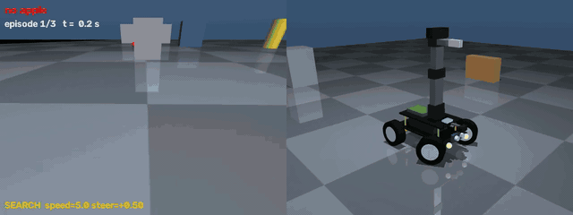

# PiCar Apple Picker — Vision-Guided Mobile Manipulation in MuJoCo

A simulated robot car, modeled after the **Adeept PiCar Pro V2** kit, that **finds a red apple with its camera, drives to it around obstacles without touching them, and picks it up with its 4-DOF arm** — fully autonomously.

Everything runs in [MuJoCo](https://mujoco.org): the robot model is written from scratch in MJCF, perception uses OpenCV on rendered camera frames, obstacles are sensed with simulated range sensors, and the controller is a hand-written state machine with a P-controller, a potential-field obstacle avoider and analytic inverse kinematics.



*Left: the robot's front camera with the detection and current state. Right: third-person view. Random apple and obstacle placements, played at 2× speed — [full-length video (MP4)](media/demo_obstacles.mp4).*

| Robot | Front camera + detection (left) / chase camera (right) |
|---|---|
|  |  |

| Grasping | Holding the apple |
|---|---|
|  |  |

## Results

Measured with `evaluate.py`. In every episode the apple is placed at a random spot 0.5–1.5 m away from the car, **in any direction** (including behind it), and six obstacles are scattered at random — one of them roughly on the straight line between the car and the apple, so the robot has to drive around it.

| Metric | Value |
|---|---|
| Clean pick-ups (apple lifted **and** no obstacle ever touched) | **87 / 90** (97 %) |
| Episodes with any obstacle contact | **0 / 90** |
| Average time to pick up | 28.0 s (simulated) |
| Camera-based apple position error | 0.5–0.7 mm mean, ≤ 1.8 mm max |

Three runs of 30 episodes with seeds 1, 2 and 3 (`python evaluate.py 30 --seed N`). A pick-up counts only if the apple is still held more than 10 cm above the ground two seconds after the grasp; an episode fails if the robot touches an obstacle even once or runs out of time (90 s).

Per seed: 30/30, 30/30, 27/30. All three failures were timeouts — the robot kept searching around the obstacles without getting the apple into view — and none of them touched an obstacle.

## What the robot can do

- **Drive like a real car** — servo-steered front wheels (both wheels coupled with an `<equality>` constraint) and motor-driven rear wheels. It can't turn on the spot, which makes both searching and avoiding harder.
- **See** — a wide-angle front camera for navigation and a camera on the arm, like the real kit.
- **Sense obstacles** — nine range-sensor rays: a sonar fan at the bumper, two corner sensors and two side sensors.
- **Detect the apple** — HSV color segmentation + shape filtering, so a red box is *not* mistaken for the apple.
- **Search → approach → avoid → align → grasp → lift** — a state machine that decides what to do ~30 times per second.
- **Remember where the apple is** — if the apple drops out of view while driving around an obstacle, the robot keeps heading for its remembered position.
- **Locate the apple in 3D from a single image** — a ray from the camera through the apple's pixel, intersected with the ground plane.
- **Move the arm with inverse kinematics** — closed-form IK (yaw + two-link law of cosines) keeping the gripper pointed down.
- **Keyboard teleoperation** — hold-to-move driving and arm control in the MuJoCo viewer.

## How it works

### 1. Robot model (`picar.xml`)
- Two-layer chassis, 18650 battery pack, Raspberry Pi board, sonar, headlights — dimensions follow the real kit.
- **Steering**: each front wheel sits inside a *knuckle* body that rotates about z; the wheel itself rotates about y.
- **Arm**: `arm_yaw → shoulder → elbow → wrist` + a parallel gripper (two slide joints coupled by an equality constraint).
- **Actuators**: `velocity` actuators for the rear wheels, `position` actuators (servos) for steering and the arm, with realistic torque limits (`forcerange`) — without them the arm could shove the whole car across the floor.
- **Sensors**: nine `rangefinder` rays (see below), joint position/velocity, frame position.
- **World**: the apple, six obstacles (boxes and pillars, none of them red) that Python re-positions for every episode, and a wall.

### 2. Perception (`vision.py`)
1. Convert the frame to HSV and threshold red. Red wraps around the hue circle, so two ranges are combined: H 0–10 and 170–180 (S ≥ 120 removes the apple's faint floor reflection).
2. Find contours and keep only apple-like blobs:
   - **circularity** `4πA/P² ≥ 0.80` (circle = 1.0, square ≈ 0.785)
   - **≥ 5 corners** after polygon simplification (a box always simplifies to 4)
3. The largest remaining blob is the apple → center `(cx, cy)` and area.

The thresholds were chosen by *measuring* both objects over a 300-frame drive: circularity alone overlaps (an apple cut by the image edge drops to 0.77, a box can reach 0.79), while the corner count separates them cleanly.

### 3. Obstacle sensing and avoidance (`apple_seeker.py`)

```
          side_left (90°)        corner_left (60°)
                 ▲                  ↖   sonar fan: +30° +15° 0° −15° −30°
          ┌──────┴──────────────────┐ ↖ ↑ ↗
          │  rear              front│── bumper
          └──────┬──────────────────┘ ↙ ↓ ↘
                 ▼                  ↙
          side_right (−90°)      corner_right (−60°)
```

- **Sonar fan (±30°)** — a real ultrasonic sensor sends a cone, not a thin ray; one ray missed obstacles off to the side of the 24 cm-wide car.
- **Corner sensors (±60°)** — the fan can't see right beside the front wheels; that blind spot is where the car first clipped obstacles while turning.
- **Side sensors (±90°)** — when a car turns, its inner rear wheel cuts the corner, so an obstacle the front has already passed can still be hit by the rear.

Each ray's origin and direction are read from the XML, so every reading becomes a point `(ahead, sideways)` in the car's frame. From those points:
- **Potential field** — every point closer than 0.5 m pushes the steering away from itself (stronger when closer); the goal's steering is scaled down by how close the nearest obstacle is, and the car slows down when its path is not clear.
- **No turning into a side obstacle** — if a side sensor sees something within 10 cm, steering toward that side is blocked.
- **EVADE** — if something is less than 12 cm ahead in the car's path, or less than 6 cm from a front corner, or the car is stuck (commanded to move but hasn't moved for 1.4 s), it reverses while turning its nose toward the side whose *nearest* obstacle is farther away.

### 4. Decision making (`apple_seeker.py`)

```
SEARCH ⇄ EXPLORE
   │ apple seen
   ▼
APPROACH ──close & centered──▶ REACHED ──▶ PICKING ──▶ HOLDING
 │  ▲   ▲
 │  │   └── BACKUP (close but off-center)
 ▼  │
GOTO (apple out of view, drive to its remembered position)

EVADE can interrupt SEARCH / EXPLORE / APPROACH / GOTO at any time.
```

- **SEARCH** — drives a *figure-eight* (a full circle one way, then a full circle the other way). Circling in one direction only never sees an apple that sits inside the turning circle, because the camera always faces outward. After an evade, the next circle turns toward the open side.
- **EXPLORE** — if a whole figure-eight finds nothing (the apple is hidden behind obstacles), drive straight for ~3 s and search again from a new spot.
- **APPROACH** — P-controller on the horizontal image error: `steering = -K · (cx − 320) / 320`, slowing down as the apple's area grows, plus the obstacle push.
- **GOTO** — every time the apple is seen, its position is stored in world coordinates; when it drops out of view (typically while driving around an obstacle), the car steers toward that stored point.
- **BACKUP** — if the apple is close but too far to the side (for the arm, or for the car's turning radius), the car reverses with opposite steering and approaches again, instead of circling around the apple and bumping it away.
- **REACHED → PICKING** — the apple's 3D position is computed from its pixel, then the arm runs a pick sequence: above → descend → close → lift → carry.

> **Simplification:** to remember the apple's position the robot needs its own pose. It uses the true pose from the simulator as "odometry". A real robot would estimate it from wheel encoders and an IMU, and that estimate drifts over time.

### 5. Manipulation (`arm.py`)
- `pixel_to_chassis` — back-projects the apple's pixel using the camera's field of view and pose, intersects the ray with the plane `z = apple radius`, and returns the point in the car's frame.
- `inverse_kinematics` — yaw from `atan2`, then elbow and shoulder from the law of cosines; the wrist angle keeps `shoulder + elbow + wrist = 90°` so the gripper points straight down. Verified against MuJoCo's forward kinematics (0.0 mm error).
- `PickSequence` — linear interpolation between IK poses.

## Engineering problems solved along the way

Every row was found by running the benchmark, looking at the failures (logs and top-down path plots) and fixing the cause.

| Problem | Cause | Fix |
|---|---|---|
| Whole robot rendered black | `<light>` elements placed inside the chassis body | Removed them; headlights use emissive materials |
| Arm couldn't reach the floor | Links too short, joint limits too tight | Lengthened links, widened ranges |
| Gripper touching the floor pushed the car 10 cm | Position servos with unlimited torque | Realistic `forcerange` on arm servos |
| Grasped cube slowly slid out | Soft contacts + pyramidal friction cone let held objects creep | `cone="elliptic"`, `impratio="10"`, `noslip_iterations="5"` |
| Apple rolled 6.7 m after a bump | No rolling friction on the sphere | `condim="6"` with rolling friction |
| Front camera blocked by the sonar | Camera mounted behind the sonar board | Moved onto a bracket in front of it, tilted 30° down |
| Search never found some apples | Apple inside the turning circle; guessed circle time was off by 47% | Figure-eight search with a measured circle period (14.1 s) |
| Hold-to-move keys didn't work | The viewer reports neither key repeats nor releases on macOS | Poll the real keyboard state via macOS `CGEventSourceKeyState` |
| Front wheel clipped obstacles while turning | Blind spot beside the front wheels, outside the ±30° sonar fan | Corner sensors at ±60° |
| Rear wheel clipped obstacles | Inner rear wheel cuts the corner in a turn; no sensor at the side | Side sensors + "don't turn toward a close side obstacle" |
| Robot gave up on an apple it had seen | Apple left the camera view while detouring around an obstacle | Remember the apple's world position and GOTO it |
| Robot pushed the apple away | Circling around an apple that was close but off to the side | BACKUP when the apple is close and far off-center |
| Evade loop between two obstacles | "Open side" was chosen by *summing* ray distances, so one obstacle 6 cm away looked harmless | Judge each side by its *closest* obstacle |
| Search wandered 3 m away | Evades kept restarting the same circle toward the same obstacle | After an evade, circle toward the open side; EXPLORE only after a full figure-eight |

## Project structure

```
picar.xml         Robot + world model (MJCF)
vision.py         Apple detection (HSV mask + shape filter)
arm.py            Pixel → 3D, inverse kinematics, pick sequence
apple_seeker.py   Autonomous brain: search, avoid obstacles, approach, grasp (live windows)
evaluate.py       Headless benchmark with random apple and obstacle placements
record_demo.py    Renders the demo video straight from the simulation
camera_view.py    Live front-camera view with detection
teleop.py         Keyboard control in the MuJoCo viewer (macOS)
world.xml         First MuJoCo scene (floor, light, falling box)
car.xml           Early 4-wheel car prototype
media/            Demo video, GIF and screenshots
```

## Getting started

Tested on macOS (Apple M1) with Python 3.14 and MuJoCo 3.14.

```bash
git clone https://github.com/Jeymsbond97/picar-mujoco-apple-picker.git
cd picar-mujoco-apple-picker
python3 -m venv venv
source venv/bin/activate
pip install -r requirements.txt
```

### Run

```bash
python apple_seeker.py         # autonomous run — press r for a new random apple + obstacles, q to quit
python evaluate.py 30 --seed 1 # benchmark (headless)
python record_demo.py          # render media/demo_obstacles.mp4 (front camera + third-person view)
python camera_view.py          # live camera + detection while driving in a circle
mjpython teleop.py             # keyboard control (macOS: the passive viewer requires mjpython)
python -m mujoco.viewer --mjcf=picar.xml   # just look at the model
```

### Keyboard controls (`teleop.py`)

| Key (hold) | Action |
|---|---|
| ↑ / ↓ | Drive forward / backward |
| ← / → | Steer left / right |
| Enter | Emergency stop |
| Z / X | Arm yaw left / right |
| U / J | Shoulder forward / back |
| Y / H | Elbow forward / back |
| V / B | Wrist down / up |
| O / C | Open / close gripper |

`teleop.py` reads the keyboard through macOS APIs, so the terminal needs **Input Monitoring** permission (System Settings → Privacy & Security).

## Tech stack

- **MuJoCo 3** — physics, MJCF modeling, rangefinder sensors, offscreen rendering (`mujoco.Renderer`), passive viewer
- **OpenCV** — HSV segmentation, contours, shape analysis
- **NumPy** — geometry, camera back-projection, inverse kinematics
- **Python** + `ctypes` (macOS Quartz keyboard state)

## Next steps

- Replace the true-pose "odometry" with wheel-encoder + IMU dead reckoning and see how the drift affects GOTO.
- Build a small occupancy map instead of purely reactive avoidance, and plan paths through it.
- Replace color detection with a learned detector (YOLO) and an open-vocabulary model.
- Language commands through a local LLM/VLM ("find the red apple and bring it here").
- Train the same task with reinforcement learning (Gymnasium + PPO) and compare with this hand-written controller.
- Sim-to-real: run the same "brain" on a physical Raspberry Pi robot car.
